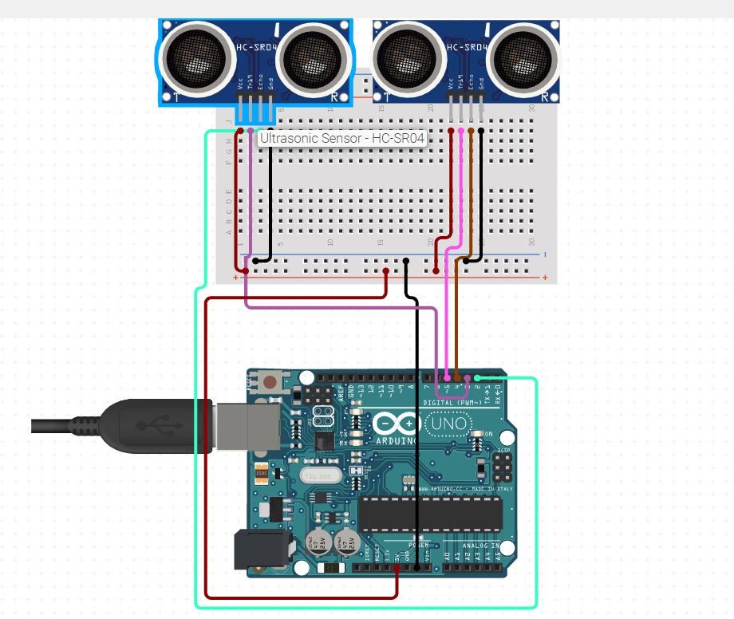
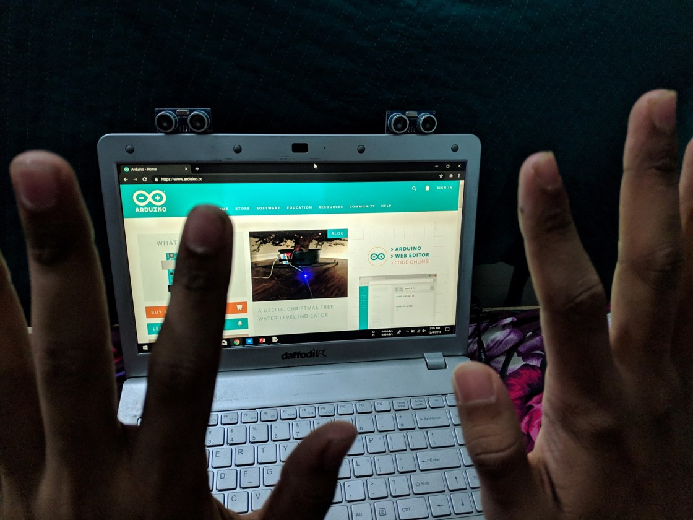
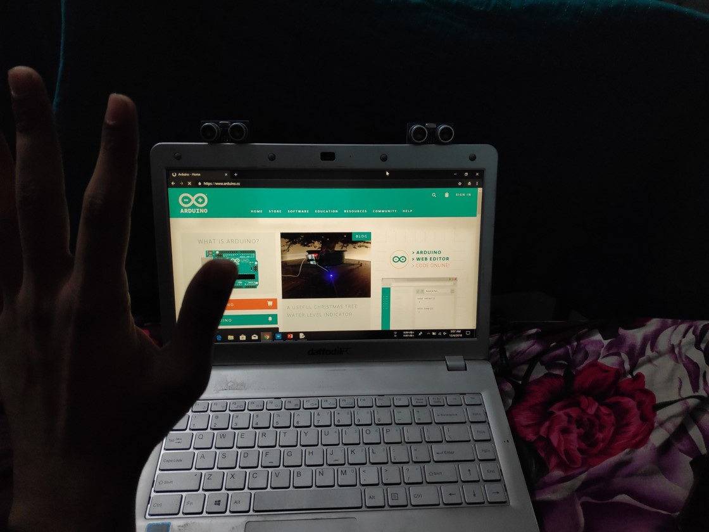

# Computer Control Using Gestures 
Arduino based computer control using hand gestures with Python.
# First Things First You need to have several things before you start, a rough list of the items that you need is given below: 
### Hardware 
- Arduino Uno 
- Small Breadboard 
- 2/1 HC-04 Ultrasonic Sensor 
- Jumper Cables 
### Software 
- Arduino IDE 
- Python 
- pyautogui library 
# Hardware Connection

# Coding Parts


## Programming Arduino

#### Configuring pin numbers:
```
const int trigger1 = 2; //Trigger pin of 1st Sesnor
const int echo1 = 3; //Echo pin of 1st Sesnor
const int trigger2 = 4; //Trigger pin of 2nd Sesnor
const int echo2 = 5;//Echo pin of 2nd Sesnor
```

#### Configuring Variables
```
long time_taken;
int dist,distL,distR;
```

#### Setup Function
```
void setup() {
Serial.begin(9600); 
  
pinMode(trigger1, OUTPUT); 
pinMode(echo1, INPUT); 
pinMode(trigger2, OUTPUT); 
pinMode(echo2, INPUT); 
}
```
#### Distance Calculate Function
```
void calculate_distance(int trigger, int echo)
{
digitalWrite(trigger, LOW);
delayMicroseconds(2);
digitalWrite(trigger, HIGH);
delayMicroseconds(10);
digitalWrite(trigger, LOW);

time_taken = pulseIn(echo, HIGH);
dist= time_taken*0.034/2;
if (dist>50)
dist = 50;
}
```
#### Loop Function
```
void loop() { //infinite loopy
calculate_distance(trigger1,echo1);
distL =dist; //get distance of left sensor

calculate_distance(trigger2,echo2);
distR =dist; //get distance of right sensor

//Pause Modes -Hold
if ((distL >40 && distR>40) && (distL <50 && distR<50)) //Detect both hands
{Serial.println("Play/Pause"); delay (500);}

calculate_distance(trigger1,echo1);
distL =dist;

calculate_distance(trigger2,echo2);
distR =dist;

 

//Control Modes
//Lock Left - Control Mode
if (distL>=15 && distL<=19)
{
  delay(100); //Hand Hold Time
  calculate_distance(trigger1,echo1);
  distL =dist;
  if (distL>=15 && distL<=19)
  {
    Serial.println("Left Locked");
    while(distL<=40)
    {
      calculate_distance(trigger1,echo1);
      distL =dist;
      if (distL<15) //Hand pushed in 
      {Serial.println ("Vup"); delay (300);}
      if (distL>20) //Hand pulled out
      {Serial.println ("Vdown"); delay (300);}
    }
  }
}

//Lock Right - Control Mode
if (distR>=15 && distR<=19)
{
  delay(100); //Hand Hold Time
  calculate_distance(trigger2,echo2);
  distR =dist;
  if (distR>=15 && distR<=19)
  {
    Serial.println("Right Locked");
    while(distR<=40)
    {
      calculate_distance(trigger2,echo2);
      distR =dist;
      if (distR<15) //Right hand pushed in
      {Serial.println ("Rewind"); delay (300);}
      if (distR>20) //Right hand pulled out
      {Serial.println ("Forward"); delay (300);}
  }
}
}

delay(200);
}
```

## Installing pyautogui Library
##### Open Windows Command prompt and change the directory to the folder where you have installed python. 
###### By default the command should be
```
cd C:\Python27
```
###### Then run this command to install pyautogui library
```
python –m pip install pyautogui
```
## Programming Python
#### Import essential libraries
```
import serial #Serial imported for Serial communication
import time #Required to use delay functions
import pyautogui
```
#### Establishing connection with com ports
```
ArduinoSerial = serial.Serial('com3',9600) #Create Serial port object called arduinoSerialData
time.sleep(2) #wait for 2 seconds for the communication to get established
```
#### Main codes that will compare hand distance and trigger different tasks
``
while 1:
    incoming = str (ArduinoSerial.readline()) #read the serial data and print it as line
    print incoming
    
    if 'Play/Pause' in incoming:
        pyautogui.typewrite(['space'], 1.0)

    if 'Rewind' in incoming:
        pyautogui.hotkey('ctrl', 'left')  

    if 'Forward' in incoming:
        pyautogui.hotkey('ctrl', 'right') 

    if 'Vup' in incoming:
        pyautogui.hotkey('down')
        
    if 'Vdown' in incoming:
        pyautogui.hotkey('up')

    incoming = "";
```
```
# How to run things after coding
#### To run the project successfully you need to do following tasks:
- Connect your Arduino board to your pc through USB cable
- Upload the arduino codes to that board
- Open python code with IDLE
- Run that code
#### That will trigger the Ultrasonic Sensor and you can control your desired task by that
## Sample Photo Of Controlling PC



# With this system you can control various task of your computer system by just waving your hand infront of your computer.
But to accomplish that you need to follow some rules or you can create yours by changing the arduino code that is given here. Whereas if you don't want to change anything you need to follow these rules:
1. To activate trigger you need to place your both hands at a particular distance of your albow from the sensors.
2. To activate one hand task you can normally put you hands at a distance of 6 inch and move it forward and backward.
### A video link of a sample is given below. You can get help from there as well
>https://drive.google.com/open?id=1gv6zlSVn4uyS-PSpJSUtHLujnpZMSOex

Thank You....
